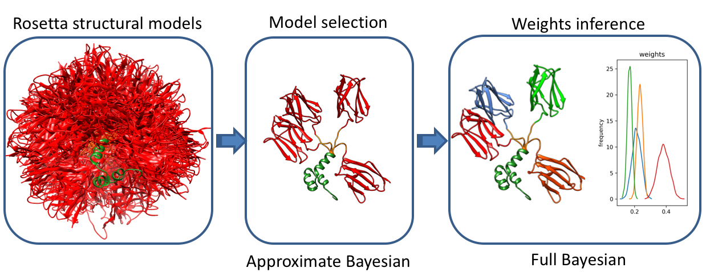
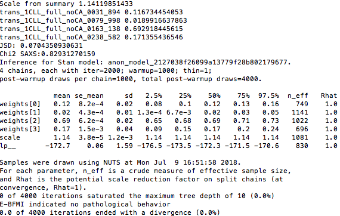
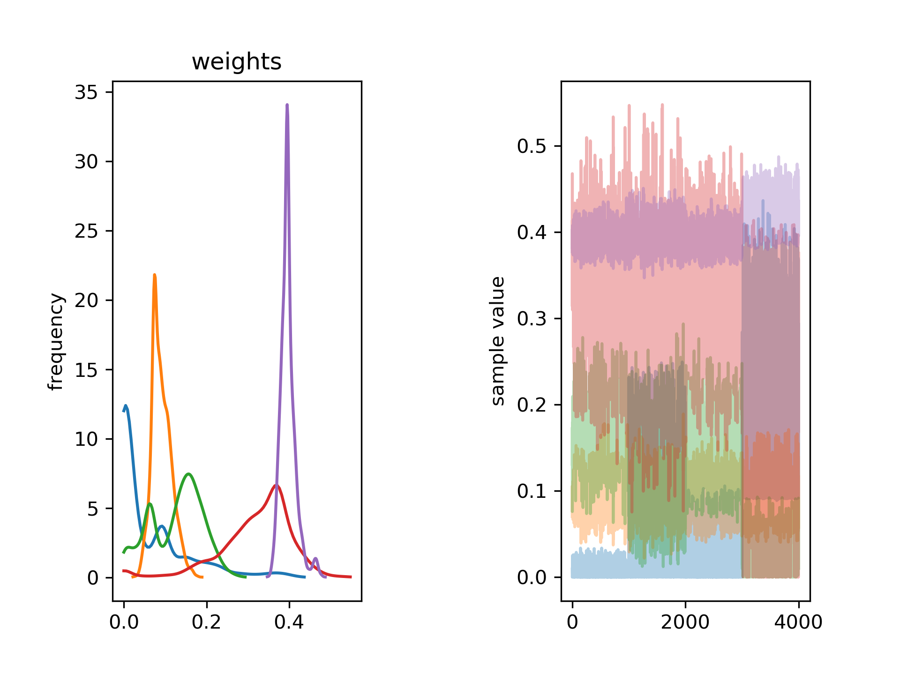

## Method overview

A method based on Bayesian statistics that infers conformational ensembles from a structural library generated by all-atom Monte
 Carlo simulations. The first stage of the method involves a fast model selection approach based on variational Bayesian inference
that maximizes the model evidence of the selected ensemble. This is followed by a complete Bayesian inference of population weights in the selected ensemble.



## Installation
1. Download the latest 64-Bit Python 3.6 Installer from [Anaconda](http://continuum.io/downloads) and run it.
2. Download [bioce file][bioce-1.0.zip] and unzip it e.g.
```
unzip bioce-1.0.zip
```
3. Install dependencies using yml file in directory where yml file is located
```
cd bioce-1.0
conda env create -f bioce.yml
```
4. Activate conda enviroment
```
source activate bioce
```
5.	Build and install software (use –user flag if you want to install it for just single user)
```
python setup.py install
```
6. Check if scripts start up
```
python variationalBayesian.py –help
python fullBayesian.py --help
```
If you see no errors but options menu pops up, you are good to go.

## Running examples

### Generating input data

The above example assumed that all input data are in the right format. This may however not be the case when you start from a set of PDB models
We assume here that you have generated set of structural models and you have experimental scattering on NMR chemical shifts data available.\
You can refer to The typical workflow may look as follows.

1. Run script to generate scattering curves
This requires FoXS to be installed and avaialable through PATH.
Since you have already installed anaconda on your machine,
the easiest way to obtain FoXS is to follow installation guide for IMP (which FoXS is part of)
at: [IMP installation](https://integrativemodeling.org/download-anaconda.html)
Once FoXS is installed, simply run:
```
prepareBayesian.py -s strcuture_lib_dir -e experimental_data
```
Apart from SimulatedIntensities.txt, which contains tabularized intensities for each model,
a file with starting weights and a list of files is generated. These files are needed
to run Bayesian inference in the next step.

2. Run variational Bayesian inference
Once you prepare input files as described in step 1, you can run model selection using variational Bayesian inference:
```
python ../variationalBayesian.py -p flat_weights5models.txt -s TrmSimulatedIntensities5models.dat -e synthetic_60p.dat -f names5models.txt -w 0.01
```
where w is the weight therhold used for prunning models in after each iteration
3. Run complete Bayesian inference
Following model selection with Variational Bayesian one can infer population weights for the subset of models inferre with VBI.
This can be done by simply running:
```
python ../fullBayesian.py -p weights.txt -s SimulatedIntensities.txt -e simulated.dat -f structures.txt
```
### Output
1. You should get simillar output to the one bellow:

2. Script also produces two images stan_weights.png and stan_scale.png,
which graphically ilustrated distribution of population weights (shown below) and scaling parameter


3. Script also returns text file containing Q vector, experimental intensity,
model intensity and experimental error.

### Using chemical shift data
1. In order to use chemical shift data, one needs to install SHIFTX2. This can be done by following instructions at:
[SHIFTX2](http://www.shiftx2.ca/download.html). This requires running python 2.6 or later, which won't work with
conda bioce enviroment. You will need to deactivate envioremnt before proceeding:
```
source deactivate
```
Once shiftx2 is installed, cd to directory with pdbs and run:
```
python shiftx2.py -b '*.pdb' -f csv
```
This will run batch job to process all pds and generate file in csv format. Please refer to shiftx2 manual for further options

2. Run a script that converts shiftx2 ouptut to input files for Bayesian inference
```
prepareChemicalShifts.py -s strcuture_lib_dir -e experimental_data
```
This will generate a few files: cs.dat, cs.err with simulated chemical shifts and
errors from PDB structures and cs_exp.dat, which contains experimental data in the aproprinate format.

### Using structural energies
Up to now any method could be used to a pool structural models and we assumed that
all models are equaly probable (by assaigining equal weights to all of them).
However one can also use information about energy evaluated for each structural models.
We use Rosetta to generate structural library and each of the models comes with energy value.
In order to make use of them, one needs to simply save them in the text file and tell scripts
to use them by suppling "-P" instead of "-p" flag, e.g.
```
python ../variationalBayesian.py -P energies.txt -s TrmSimulatedIntensities5models.dat -e synthetic_60p.dat -f names5models.txt -w 0.01
```

## Webserver
[Webserver](WEBSERVER.md) coming up soon!