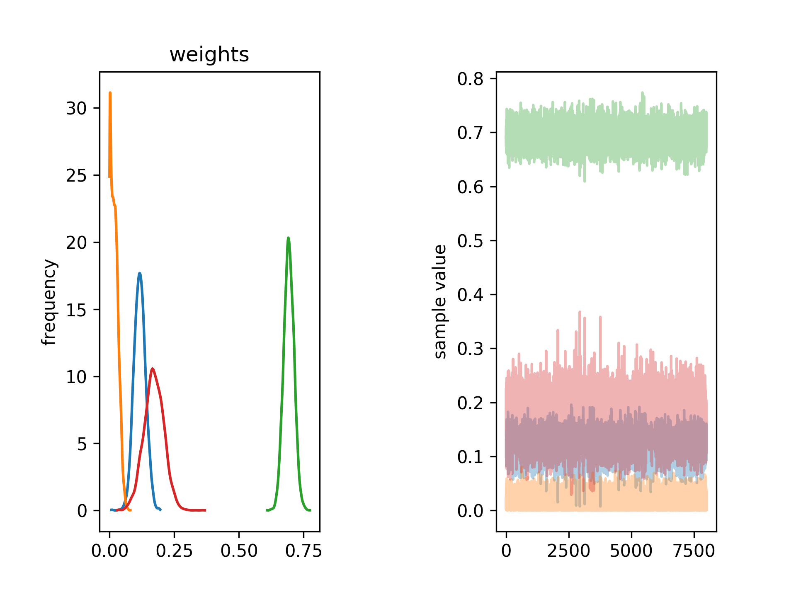

## Method overview

A method based on Bayesian statistics that infers conformational ensembles from a structural library generated by all-atom Monte
 Carlo simulations. The first stage of the method involves a fast model selection approach based on variational Bayesian inference
that maximizes the model evidence of the selected ensemble. This is followed by a complete Bayesian inference of population weights in the selected ensemble.


## Installation
1. Download the latest 64-Bit Python 3.6 Installer from [Anaconda](http://continuum.io/downloads) and run it.
2. If you don't have git installed, follow instructions at [Git page](https://git-scm.com/book/en/v2/Getting-Started-Installing-Git),
otherwise simply run in terminal:
```
git clone https://github.com/Andre-lab/bioce.git
```
3.	Install dependencies using yml file
```
cd bioce
conda env create -f bioce.yml
```
4. Activate conda enviroment
```
source activate bioce
```
5.	Build and install software (use –user flag if you want to install it for just single user)
```
python setup.py install
```
6. Check if scripts start up
```
python variationalBayesian.py –help
python fullBayesian.py --help
```
If you see no errors but options menu pops up, you are good to go.

## Running examples

### Simple run example
1. The simple example for running complete Bayesian approach with all necessary input files can be found in data folder
```
cd data
python ../fullBayesian.py -p weights.txt -s SimulatedIntensities.txt -e simulated.dat -f structures.txt
```
2. You should get simillar output to the one bellow:

>             mean se_mean     sd   2.5%    25%    50%    75%  97.5%  n_eff   Rhat
>weights[0]   0.03  4.7e-3   0.05 1.9e-9 2.2e-4 7.0e-3   0.05   0.18    105   1.04
>weights[1]   0.09  2.0e-3   0.02   0.05   0.08   0.09   0.11   0.14    128   1.03
>weights[2]   0.15  3.8e-3   0.04   0.06   0.12   0.15   0.18   0.23    128   1.02
>weights[3]   0.33  6.5e-3   0.07   0.17   0.29   0.33   0.38   0.46    118   1.03
>weights[4]   0.39  1.4e-3   0.02   0.37   0.38   0.39    0.4   0.43    118   1.03
>scale        1.02  5.2e-3   0.06   0.91   0.99   1.03   1.06   1.14    115   1.03
>lp__       -14.25    0.15   1.79 -18.95 -15.12 -13.86 -12.94 -11.94    134   1.03

>Samples were drawn using NUTS at Fri Jun 29 10:02:35 2018.
>For each parameter, n_eff is a crude measure of effective sample size,
>and Rhat is the potential scale reduction factor on split chains (at
>convergence, Rhat=1).
>878 of 4000 iterations saturated the maximum tree depth of 10 (21.95%)
>  Run again with max_depth set to a larger value to avoid saturation
>E-BFMI indicated no pathological behavior
>522.0 of 4000 iterations ended with a divergence (13.05%)
>  Try running with larger adapt_delta to remove the divergences

3. Script also produces two images stan_weights.png and stan_scale.png,
which graphically ilustrated distribution of population weights (shown below) and scaling parameter


3. Script also returns text file containing Q vector, experimental intensity,
model intensity and experimental error.

### Generating input data

The above example assumed that all input data are in the right format. This may however not be the case when you start from a set of PDB models
We assume here that you have generated set of structural models and you have experimental scattering on NMR chemical shifts data available.\
You can refer to The typical workflow may look as follows.

1. Run script to generate scattering curves
This requires FoXS to be installed and avaialable through PATH.
Since you have already installed anaconda on your machine,
the easiest way to obtain FoXS is to follow installation guide for IMP (which FoXS is part of)
at: [IMP installation](https://integrativemodeling.org/download-anaconda.html)
Once FoXS is installed, simply run:
```
prepareBayesian.py -s strcuture_lib_dir -e experimental_data
```
Apart from SimulatedIntensities.txt, which contains tabularized intensities for each model,
a file with starting weights and a list of files is generated. These files are needed
to run Bayesian inference in the next step.

2. Run variational Bayesian inference
Once you prepare input files as described in step 1, you can run model selection using variational Bayesian inference:
```
python ../variationalBayesian.py -p flat_weights5models.txt -s TrmSimulatedIntensities5models.dat -e synthetic_60p.dat -f names5models.txt
```


